# Unity XR Project Walkthrough Setup Guide Tutorial
Generic Unity 3d XR virtual reality project using XRI toolkit, OpenXR, Oculus SDK and input system.

## Overview ##

Step by step instructions on how to build the base 3d repository / project for simple 3d XR unity projects.. lazy programmers -> clone one of the releases to access this.

when building Vr projects need to change the xr plugin -> android settings for the specific device we are building for. If not OpenXR builds will display in your oculus home room, there we will need independent builds for oculus and friends. This guide will instruct you. and is based off from https://www.youtube.com/watch?v=yxMzAw2Sg5w thank you.

This is easy human, very easy. You will be a meta pro in no time using simple guide.

## BUILDING 3D VR PROJECT WITH MOST RECENT UNITY SETTINGS : PART 1 - SETUP ##

### Step 1 ###

First create a new project in unity 2021.2.10f1 using the 3d template

Once that is done, open up the project settings in the edit menu. Then in the pc tab configure the xr plugin to use Open XR with oculus selected. Then on the android tab in 
the same settings windowselect oculus not OpenXR. *NOTE* Oculus quest drivers are currently not stable within unity to oculus link, so select openXR and add oculus to the 
list of support devices from the drop down.. (or index or vive if you have that) This is the configure used to stream your app onto the device for devolopment. 

This will automagically install the required packages and drivers to your project.

*IMPORTANT* you can change the rendering mode setting on this page and tabs to `Multipass` from single pass for addition depth.. However this will render your scene twice which
requires alot more CPU budget reducing your frame timing to about 5.1ms per lense at 90 hertz. Either settings will work. Also toggle off oculus (1) in the android tab if you do not 
plan on developing for quest 2.

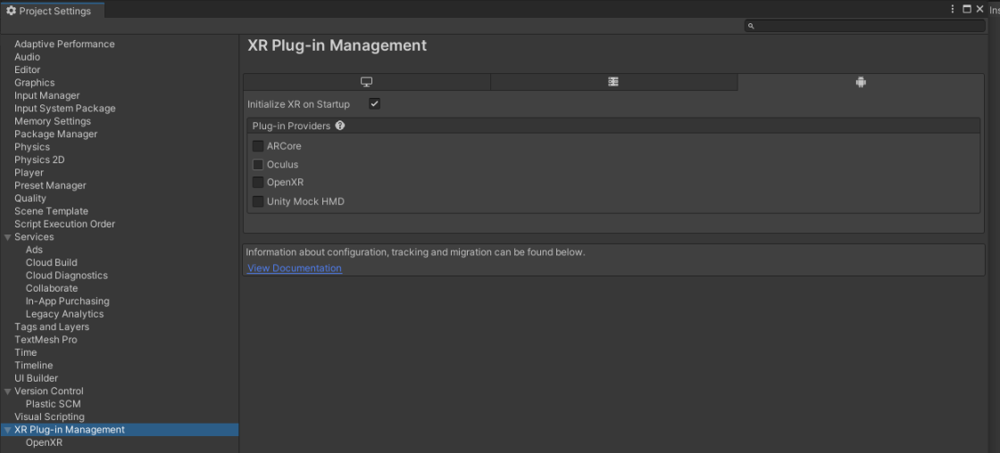


### Step 2 ###

Now we need to turn on preview packages in our package manager. open up the package manager and click the gear setting icon in the top right. toggle on preview packages. *NOTE* the
current package manager is broken, and will not display the preview packages by default so we need to manually add the XRI toolkit by click the add drop down icon in the top left of 
the package manager. Select `from git repo` from the drop down, input `com.unity.xr.interative.toolkit` and click add. Click `i understand` when prompted..

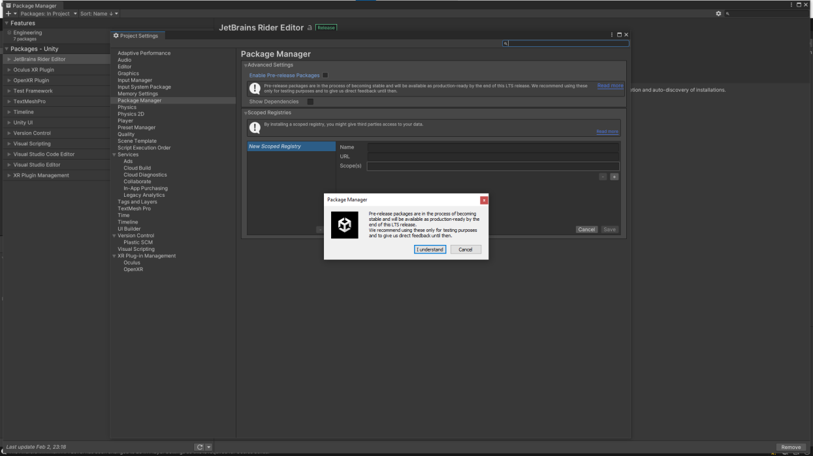

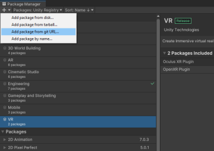

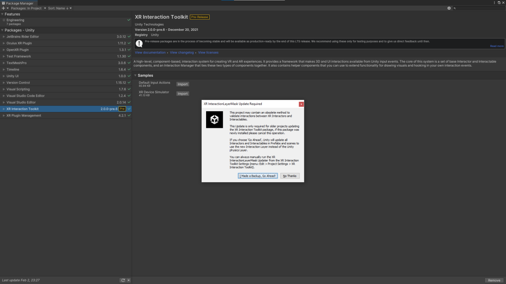

### Step 3 ###

Select the new XRI toolkit package in your list and expand the import tree, to display the extra assets to import. Import `defaul input actions`

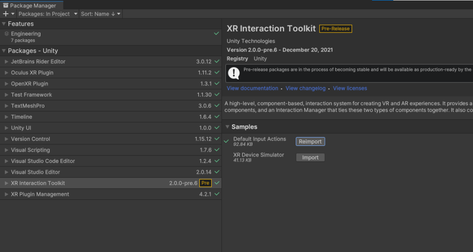

will import these new assets, they are just some preset files we will use for our input system

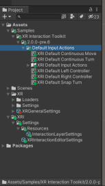

these are the project runtime and buid settings stored as scriptable objects.. smart

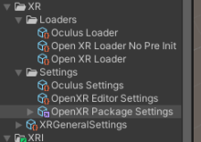

default xr input system using unity input system (new)

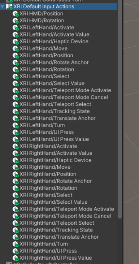

apply default action presets by clicking on button in inspector on each of the items in

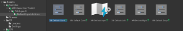

do this for each one

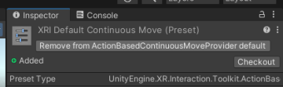

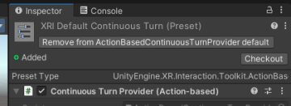

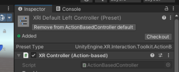

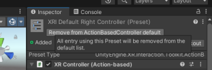

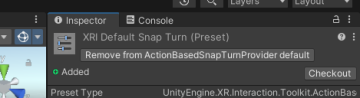

sets up the unity input system controls for headset, and left and right controls

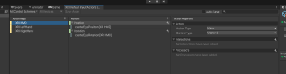

important user selection actions. this is very human, easy.

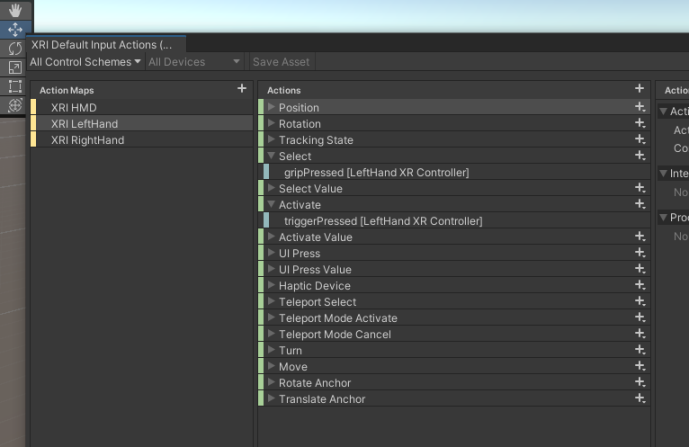

edit the project settings for the preset manager. tells unity project to use our new XRI settings. should have 5 total

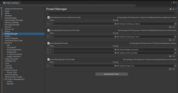

current version of unity has a bug where the left and right input controllers are not filtered, because we use one input system configuration file. enter right and left in the filter

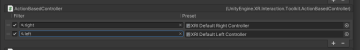

### Step 4 ###

create ground plane

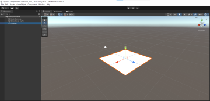

if XR installed okay, you should have these XR opens in the right click create menu

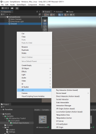

create XR Origin object in scene this has been renamed from XR Rig to avoid name collision with Animation rig naming

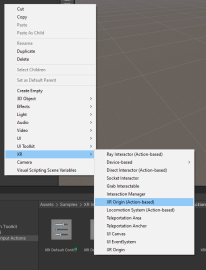

xr origin is just the head. unity will create a manager and orgin object, the cam rig and L/R controllers are represented as child objects so that they inheirt the transform.position of the headset.

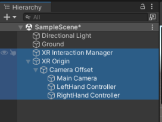

on XR Interation Manager add a new component 'Input Action Manager'

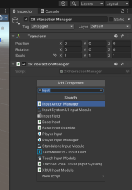

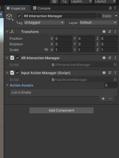

add the default action we imported on to the new input action manager component

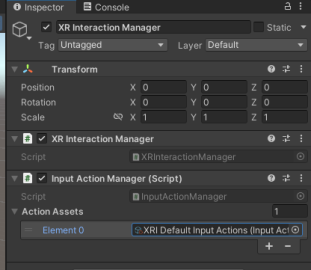

we should now see the camera fullcrum in the scene view after setting these input actions

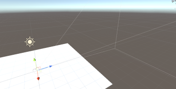

Camera Offset game object is managed by the XR controller scripts so it should not be modified. This handles our offset height we are from the floor setting within gaurdian. left hand should have the correct input's that we filtered before

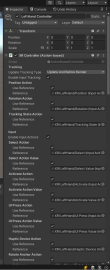

as should the right controller game object inside of the XR Origin game object. hook up oculus with link, and click play, should work. there is a known bug within OpenXR 1.3x version where actions sets are already defined,, reports error in console but game will play okay.

```
ActionSets already attached
UnityEngine.GUIUtility:ProcessEvent (int,intptr,bool&)
```

*MORE INFO* https://forum.unity.com/threads/openxr-1-3-1-actionsets-already-attached-console-logerror.1226619/

```
With OpenXR the recommendation is to use specific device bindings, because XRController is just a macro that expands to bindings 
within all the selected interaction profiles, it has no runtime benefit with OpenXR. This means it is only a shortcut for entering 
bindings and not a means of providing cross platform support. The idea is to be very specific about which controls you want mapped
to which actions per device to ensure the best gameplay on each device. Remember that the runtime is taking care of converting
controller bindings from one device to another in the event that you did not configure bindings for particular device, not unity, 
so you only need to specify bindings for the devices that you want to specifically configure and let the runtime do the rest. This 
is how OpenXR provides future proofing your games and applications since they would not need to be recompiled for newer hardware
that was not known of at the time the game was created, the runtime just needs to provide a map of controls from the devices that 
were configured to ones it knows about.

The current plan for OpenXR 2.0 will be later in 2022 and will require unity 2022+, but its early so any of that could still change. 
In 2.0 we are moving even more towards specific device bindings and away from XRController.
```

**so in sort this will be resolved** So to work around is to only select your dev device that you need to use, again these should be done in separate branches on large projects.. do not use the oculus driver for running local use the OpenXR, its more supported

## BUILDING 3D VR PROJECT WITH MOST RECENT UNITY SETTINGS : PART 2 - LOCOMOTION  ##

### Step 1 ###

add locomotion action based game object to the scene

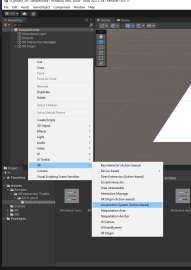

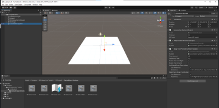

drag the locomotion system game object onto the XR origin editor field in the locomotion system script

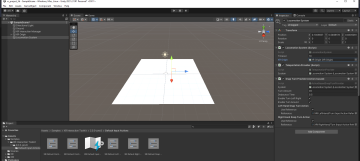

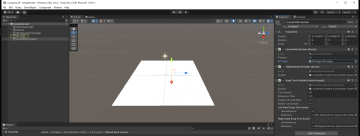

add teleportation area script onto the ground object


*NOTE:* teleportation anchor script is used to teleport onto a specific area on a teleportation area, such as a seat or chair

change ground material to a color other then white so that we can see our hand controller's  laser pointers. Lasers will turn white onto areas that you can teleport onto

create material dir in root of project asset folder

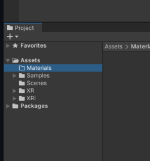


### Step 2 ###

create new material in that folder

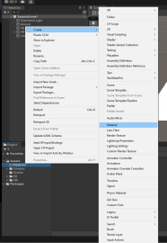

name it M_Ground where M_ is prefixed onto all of our materials see style guide for more information

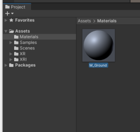

click on the material and in the inspector set the color to dark drag .. the setting is albedo

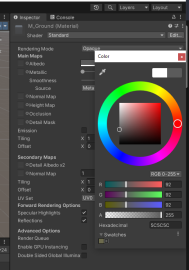

click and drag new material from project window onto the ground plane in your scene view

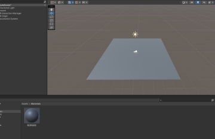

now play test with oculus link in your vr headset. you should be able to use left or right grip button to teleport around the teleportation area that we defined as the ground plane. This is very human, easy.

### Step 3 ###

disable teleportation provider and snap turn provider on the locomotion system. we need to do this before we implement continous movement and turn. NOTE  this can cause motion sickness on people new to vr so this should be a toggle option in your game settings so that they can teleport until they get used to vr movement and dont fall down and hurt themselves. important things

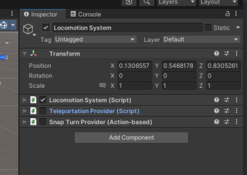

add continuous move provider action based script on the locomotion system 

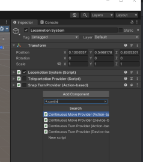

add continous turn provider script on the locomotion system

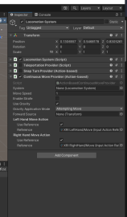

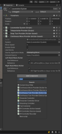

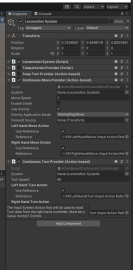

define our loco system on these two new component scripts

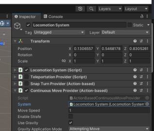

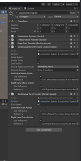

configure move and turn to use left stick for move and right for turn

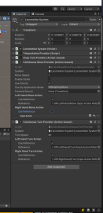

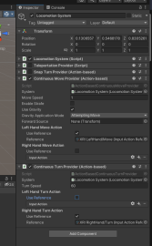

now play test in your scene on the headset and you should be able to move around and not teleport..

```
IMPROVEMENT: a better control scheme should be that instead of turn continously we should strafe left and right. 
Then we turn based on where we are looking at in the headset. similiar to how you turn on FPS games.. maybe try 
implementing the rotate towards script found in the character controller of the bad cat engine, no games right
analog turns players this is super wonky, also this will allow us to push the right stick forward to sprint while 
the left stick is forward
```

This is very human, easy.

## BUILDING 3D VR PROJECT WITH MOST RECENT UNITY SETTINGS : PART 3 - GRABBING  ##

### Step 1 ###

first create a 3d cube

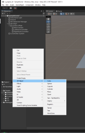

make sure to set its origin transform to 0,0,0

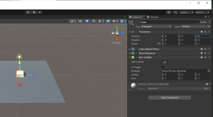

set the scale of the cube to .2 so that its easy to pick up with one hand

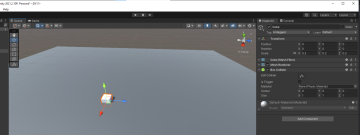

now position the cube infront of our camera , the directon the xr orgin is  facing (blue axis, z+) and set the y to .1 and z to 1

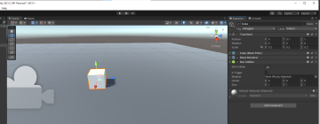

now we add the xr grab interactable script to the cube

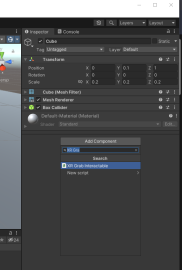

this will automagically add a rigidbody (physics) and script onto the object


set the RB (rigidbody) to use continuos collision detection so that the physics are not janky


in the grab interactable script toggle on smooth position and smooth rotation


select velocity tracking option in the movement type drop down menu


this makes it so that we can not move objects through the wall. kinematic option takes into account the rigidbodys momentum and velocity but can go through walls

this also addes a few more options in the tracking settings


that allows us to fine tune the dampers on the object tracking,, adjusts the lerp of the transform position. instantanseous will teleport the object.. these cost performance to keep that in mind when using IK on various objects.

now play test.

### Step 2 ###

We need to disable the object anchors on the cube we grab. This setting tells the XRI system to allow the tracking controller analog sticks to be able to move the cube toward or away, and rotate while grabbed, this is useful if we are building stuff and want to be able to specifically place something. select the left and right controller in the scene hierachy


 scroll the inspector down to show this script that is attached to both controllers


uncheck anchor control


now when you play test you can not rotate or move the cube when your grabbing it

This is very human, easy

## *BUILDING 3D VR PROJECT WITH MOST RECENT UNITY SETTINGS : PART 4  - BUILD RUNTIME ##

### Step 1 ###
this section outlines the minimal process required to build your project for distribution. This should be able to generate an APK which you can share

go to build settings
 


now click and drag the scene object in your hierachy window into the scenes in build box on the build settings to add it to the build


select the android option on the bottom left of the window


if the build and run button on the bottom right is grayed out, click the switch platform button to the right of it to switch to the oculus platform sdk. wait a few minutes while all the code switches over and recompiles. now click on the build which will create a sharable executable and also put the apk.


make a new a new directory on your desktop or anywhere you prefer


**SUCCESS, GOOD JOB HUMAN; VERY EASY** you just built your first oculus app

### Step 2 ###

Now lets put it on the device. this used to be a pain, but oculus has a easy to use piece of software that you can use to manage your dev, its call `dev hub`.

https://developer.oculus.com/downloads/package/oculus-developer-hub-win/


click the download and install and make sure to run as administrator; lastly click install
 


click finish and make sure to click install
 

 
opening it should look like


 
### Step 3 ###

click on the download option in the left menu and then select other packages, look for Oculus ADB drivers


click download and install, this with automagically configure these. on this setting tab you should see that your ADB is link properly


also on the other packages page in downloads its a good idea to install the CLI tools by installing the Platform utils CLI


this will allow us to be able to write scripts to automagically push and distribute our devices which is especially useful when using unities scriptable build tools

you can find all the goodies to this util here https://developer.oculus.com/resources/publish-reference-platform-command-line-utility/

click on your device manager and drag the apk your built onto the right panel


click launch after it copies over and viola you have a working app manually installed onto your oculus... easy peasy only 78 steps for human easy.

** GOOD JOB HUMAN :)* you are awarded one smoothie as your treat. 

*batteries not included*

